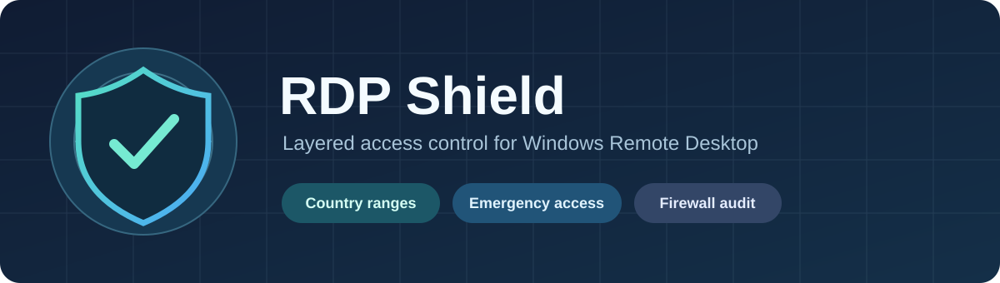

# RDP Shield



**Country-based RDP access, dynamic emergency access, and firewall visibility for Windows.** RDP Shield is a PowerShell toolkit being developed for Windows Server. [IPBan](https://github.com/DigitalRuby/IPBan) can provide an independent brute-force protection layer; automatic IPBan integration is planned.

**Want IPBan protection? Install IPBan separately first.** RDP Shield does not download or install it. Use the official [IPBan Windows installation instructions](https://github.com/DigitalRuby/IPBan#install) or the [official releases](https://github.com/DigitalRuby/IPBan/releases), then enable the optional integration when it becomes available.

> [!WARNING]
> **Development status:** The scripts are not yet a production-ready installer. The firewall workflow has not been tested on Windows Server. Keep an open session and an independent recovery path when testing RDP rules.

## How it works

| Layer | Current capability |
|---|---|
| Country ranges | Download and validate IPv4 CIDR ranges from [IPdeny](https://www.ipdeny.com/ipblocks/data/aggregated/) for a configured country. |
| Emergency access | Resolve static IPv4 addresses and DNS names before updating dedicated TCP and UDP firewall rules. |
| Firewall audit | Find other active inbound Allow rules that may still admit traffic to the RDP port. |
| Firewall rules | Stage or update rules owned by RDP Shield, with a Windows Firewall export before changes. |
| Status | Report country data, resolved emergency addresses, managed rules, and possible competing Allow rules. |
| IPBan | Runs separately today. [Optional integration plan](docs/IPBAN-INTEGRATION.md) is on the roadmap. |

An Allow rule scoped to a country does **not** restrict traffic allowed by another active rule. The audit must be clear before claiming that RDP access is geographically restricted.

## Configuration

Copy `config/config.example.json` to `config/config.json`. The working configuration is ignored by Git. Set `Country`, `RdpPort`, and at least one IPv4 address or DNS name in `EmergencyAccess`.

```json
"EmergencyAccess": ["my-access.example.org", "203.0.113.10"]
```

These addresses are examples only. Check that your emergency access resolves correctly before making firewall changes.

## Read-only and local validation

Run these from the repository root in PowerShell. Country download writes only to the ignored `data/` directory. Firewall audit requires administrator privileges.

```powershell
.\src\RDPShield-Resolve-Emergency.ps1 -ResolveOnly
.\src\RDPShield-Update-Country.ps1
.\src\RDPShield-Apply-Firewall.ps1 -ValidateOnly
.\src\RDPShield-Audit-Firewall.ps1
.\src\RDPShield-Status.ps1 | Format-List
```

## Staging firewall rules in a test environment

Run elevated on a Windows test host after validating the configuration. `-StageOnly` creates country and emergency TCP/UDP rules without disabling existing rules. **The country filter is not effective while a broader Allow rule remains enabled.** The script saves a `.wfw` export in the ignored `backup/` directory.

```powershell
.\src\RDPShield-Apply-Firewall.ps1 -StageOnly -WhatIf
.\src\RDPShield-Apply-Firewall.ps1 -StageOnly
```

Review the audit results and verify remote access before changing any pre-existing firewall rules. The project does not yet automate that migration or rollback.

## Preview installer and scheduled refresh

The installer copies scripts and configuration to `%ProgramData%\RDPShield`. Its default action prepares files and downloads the country list. `-StageFirewall` additionally creates the four managed firewall rules. `-RegisterTasks` adds daily country refresh and periodic emergency DNS refresh as SYSTEM; it requires `-StageFirewall`. It does not disable or edit existing firewall rules.

```powershell
.\Install-RDPShield.ps1 -PlanOnly
.\Install-RDPShield.ps1 -WhatIf
.\Install-RDPShield.ps1 -StageFirewall -RegisterTasks
```

The commands above require a populated `config/config.json`; the third command changes the local Windows firewall and scheduled tasks and must only be run in a disposable test environment for now. The installer refuses to overwrite an existing installation. `Uninstall-RDPShield.ps1` removes its scheduled tasks; use `-RemoveFirewallRules` only when an independent RDP access path has been checked. It leaves installed files and firewall exports for review.

## Smoke tests

The offline smoke test checks address resolution, country list validation and preservation, firewall input validation, and the install plan without changing the firewall:

```powershell
powershell.exe -NoProfile -ExecutionPolicy Bypass -File .\tests\Smoke.ps1
```

## Roadmap

1. Add isolated tests for firewall audit, rule updates, scheduled tasks, and uninstall.
2. Add a controlled migration and rollback procedure for pre-existing RDP rules.
3. Test installation and recovery on Windows Server before the first stable release.

The local `Scripts` directory contains server-specific reference material and is excluded from Git. RDP Shield is released under the [MIT License](LICENSE).
